# Ejercicio 1 — Cambiar la ubicación del Wumpus y los pits

Para el ejercicio se crearon 2 diseños diferentes de cueva para comparar cada agente, uno sencillo en donde el agente puede recoger el oro sin problemas y otro difícil en el cuál el agente debe de matar al _Wumpus_ para poder obtener el oro.

| Sencilla                                            | Dificil                                           |
| --------------------------------------------------- | ------------------------------------------------- |
| 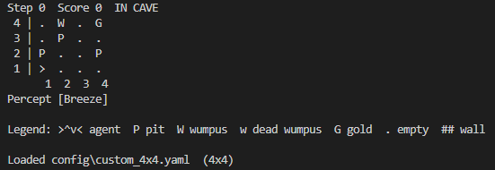 | 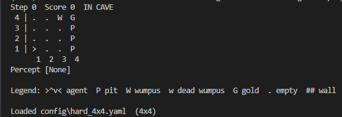 |

Ninguno de los modelos de agente del proyecto pudo salir con el _oro_ de la cueva, a continuación se especifica la razón de cada uno de ellos junto con capturas de la ejecución de los mismos:

- Reflejo: al iniciar junto a un _PIT_ este percibe el _breeze_ lo que lo hace girar a su derecha, sin embargo, al no modificar su posición de celda terminaba entrando en un ciclo girando a su derecha de forma indefinida.

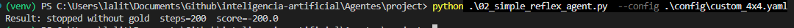

- Modelo y meta: debido a la colocación del _PIT_ en _(1,2)_ el agente percibe un _breeze_ y dado que no puede asegurar si el _PIT_ se encuentra en _(1,2)_ o _(2,1)_ y no existir otra celdas no visitadas ya que se encuentra al principio del nivel, termina ejecutando la acción base _*TurnLeft*_ quedándose ciclado igualmente, de forma alternativa, si se mueve ese _PIT_ a la casilla _(4,1)_ ambos agentes empiezan a explorar por el mapa, sin embargo, llega un punto en el que no tienen más camino seguro por recorrer por lo que terminan teniendo ejecutando el mismo ciclo de acciones en bucle.

| Modelo                                          | Metas                                         |
| ----------------------------------------------- | --------------------------------------------- |
| 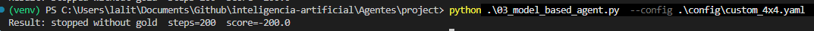 | 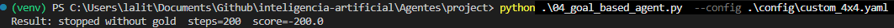 |

- Utilidad: la superposición del _breeze_ en (2,2) por los _PITS_ _(1,2)_ y _(2,3)_, hacen que calcule erróneamente el factor de riesgo de avanzar por _(2,3)_ lo que hace que el agente termine cayendo por el _PIT_

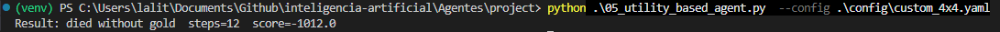

- Aprendizaje: Este algoritmo explora el mapa de manera aleatoria. Al tener un pozo cercano al inicio, la probabilidad de caer en él es alta, lo que le enseña que el costo de la muerte es excesivo. Además, al colocar el oro en el extremo opuesto del mapa, el número de iteraciones resulta insuficiente para que el agente lo descubra y pueda asimilar el camino, por lo que opta por abandonar la cueva sin el tesoro, esto lo pude confirmar al aumentar el número de episodios de 1500 a 15000 ya que con esa cantidad el agente si pudo salir usando el camino más optimo.

| 1500 episodios                                       | 15000 episodios                                                          |
| ---------------------------------------------------- | ------------------------------------------------------------------------ |
| 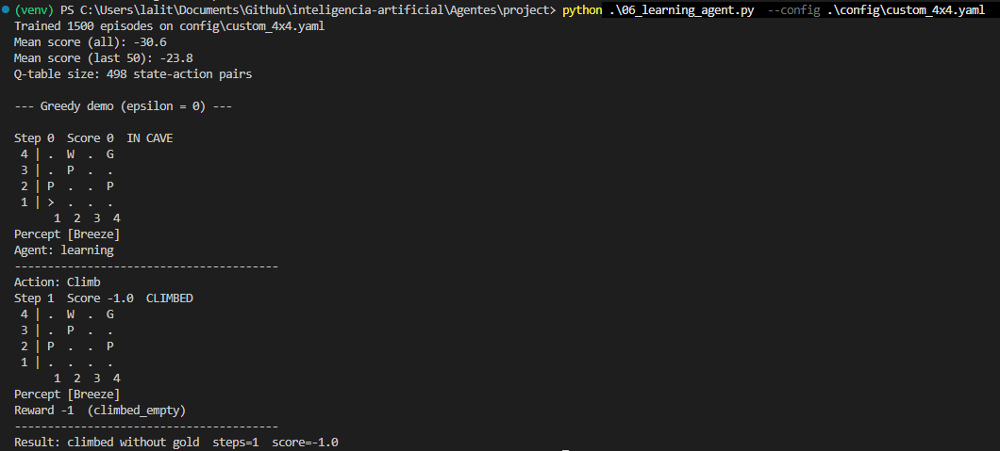 | 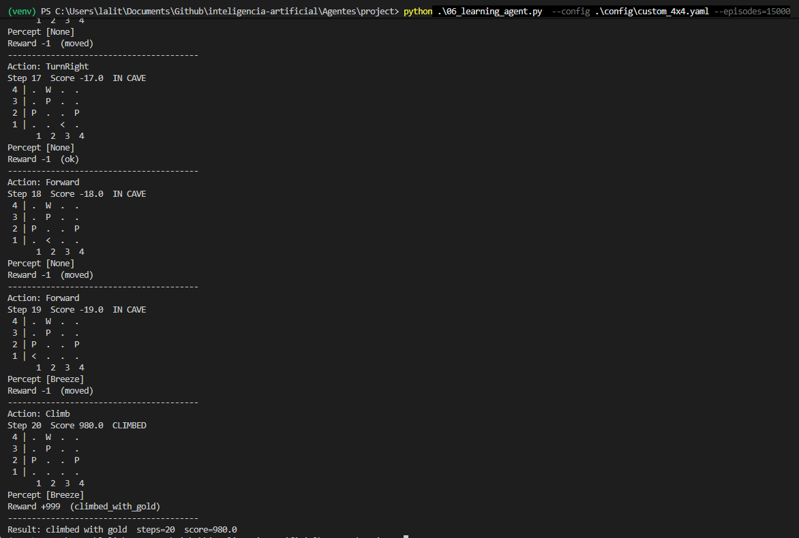 |

En cuanto a un diseño en donde se tenga que matar obligatoriamente al _Wumpus_ para poder obtener el oro, los agentes se comportan de manera similar con la unica diferencia de que tardan más en llegar a su estado ciclado o la muerte, a excepción del de aprendizaje pues este llega a la misma conclusión de salir directamente de la cueva independientemente del numero de episodios.

### Reflejo
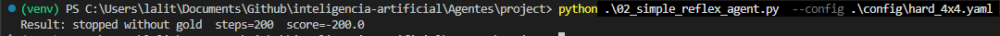
### Modelo
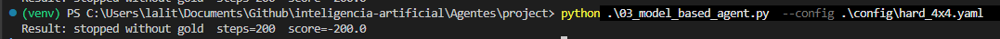
### Metas
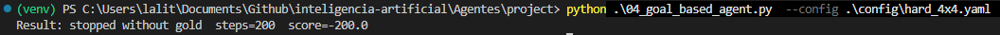
### Aprendizaje
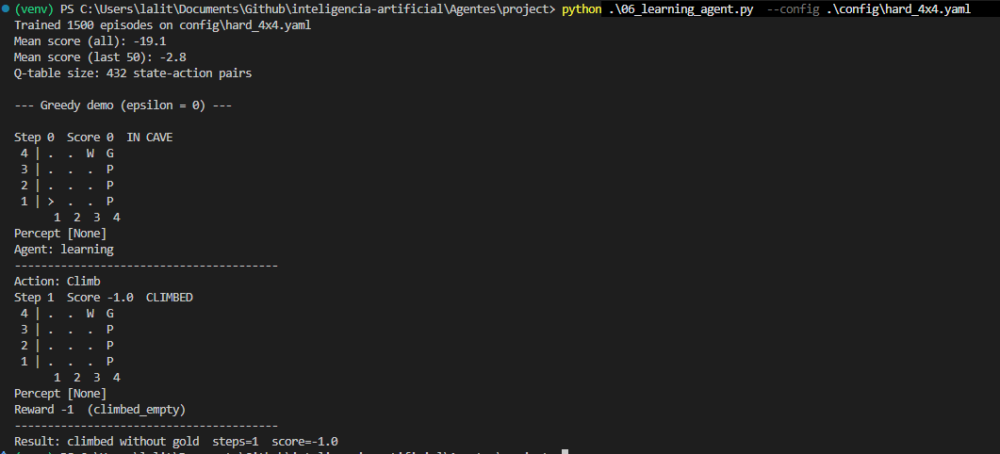
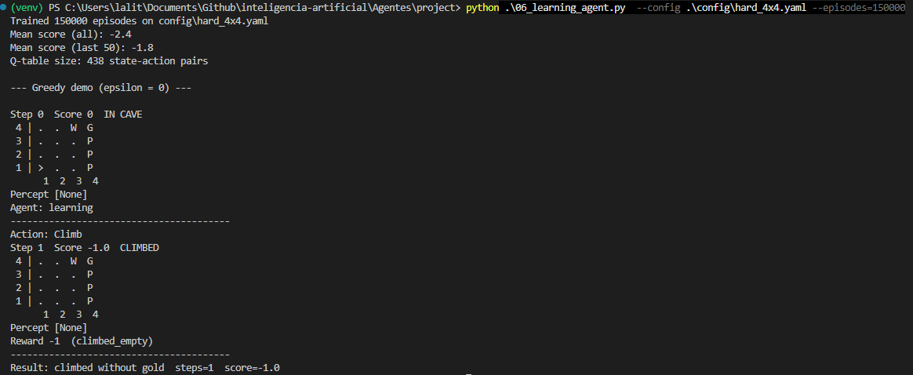
