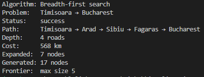
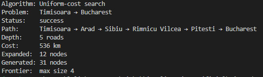
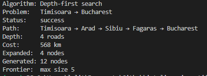
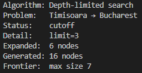
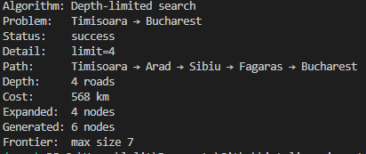
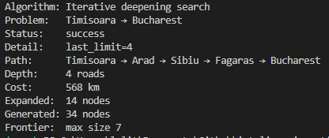
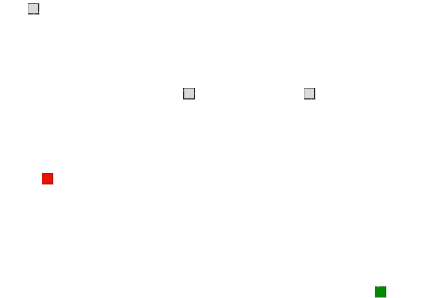
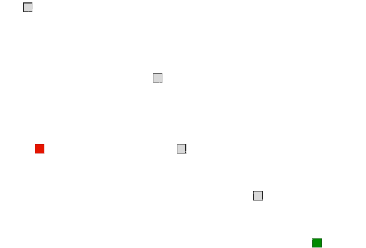

Ciudad origen: Timisoara

Ciudad destino: Bucharest

|  | BFS | UCS | DFS | DLS (limite 3) | DLS (limite 4) | IDS |
|---|---|---|---|---|---|---|
| Path | Timisoara → Arad → Sibiu → Fagaras → Bucharest | Timisoara → Arad → Sibiu → Rimnicu Vilcea → Pitesti → Bucharest | Timisoara → Arad → Sibiu → Fagaras → Bucharest | NF | Timisoara → Arad → Sibiu → Fagaras → Bucharest | Timisoara → Arad → Sibiu → Fagaras → Bucharest |
| Depth | 4 roads | 5 roads | 4 roads | NF | 4 roads | 4 roads |
| Cost | 568 km | 536 km | 568 km | NF | 568 km | 568 km |
| Expanded | 7 nodes | 12 nodes | 4 nodes | 6 nodes | 4 nodes | 14 nodes |
| Status | Sucess | Sucess | Sucess | cutoff | Sucess | Sucess |
|  |  |  |  |  |  |  |

En este ejercicio podemos notar como los distintos algoritmos prácticamente encontraron el mismo camino, sin embargo, debido a la naturaleza del algoritmo **UCS** en el que se prioriza la expansión del nodo con menor costo acumulado tenemos un camino alternativo que tiene más saltos pero un menor costo final mientras que los demás algoritmos unicamente se enfocan en la búsqueda del nodo objetivo sin importarle el peso de las aristas.

| BFS, DFS, DLS, IDS | UCS |
|---|---|
| |  | 

Por otro lado, el algoritmo **DLS** con un limite 3 no pudo encontrar el camino dado que el mínimo de saltos entre nodos requerido para encontrar la ciudad objetivo es de 4 (confirmado por BFS) es por ello que al aumentar el limite a 4 este pudo encontrar una ruta válida.

Con respecto al procesamiento requerido para obtener la ruta podemos notar como el **IDS** necesito de visitar más nodos por el funcionamiento de volver a procesar nodos ya visitados al momento de incrementar el limite, mientras que en el caso de **UCS** al estar expandiendo nodos que de forma acumulativa tengan el costo menor, se expanden nodos que no forman parte de la solución siendo esto a su vez su ventaja de encontrar siempre el camino más "barato".

Igual es importante mencionar que aunque **DFS**, para este ejercicio regreso la misma ruta que la mayoría de los algoritmos, esto solo fue una coincidencia debido a la exploración de nodos en orden alfabético. En general, el algoritmo puede llegar a generar una ruta mucho más extensa con respecto a las demás ya que el algoritmo en sí mismo se encarga de expandir una rama en su totalidad antes de regresar.