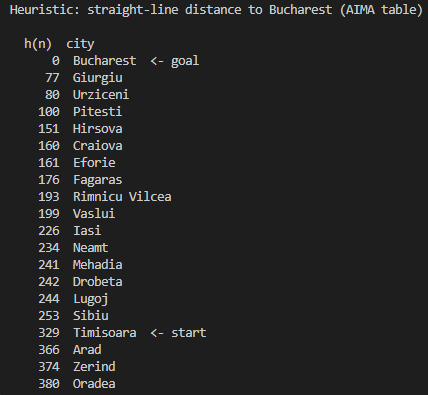
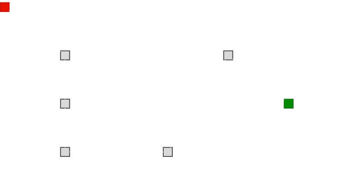
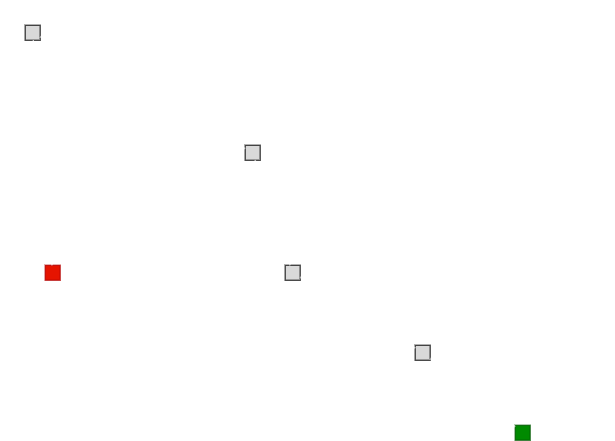
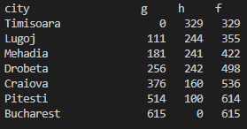
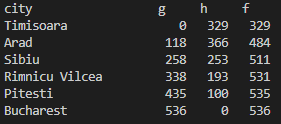
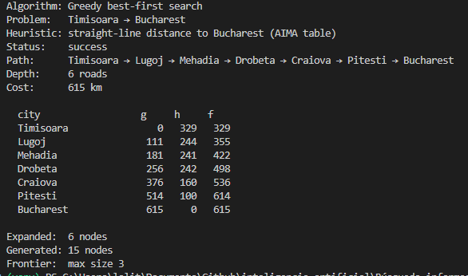
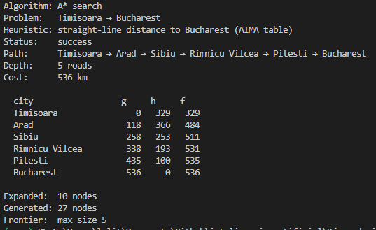

# Ejercicio 1 — Comparar Greedy y A* en el mapa de Rumania

Ciudad origen: Timisoara

Ciudad objetivo: Bucharest

## Tabla heurística




|  | Greedy | A* |
|---|---|---|
| Path | Timisoara → Lugoj → Mehadia → Drobeta → Craiova → Pitesti → Bucharest <br>  | Timisoara → Arad → Sibiu → Rimnicu Vilcea → Pitesti → Bucharest |
|  |  |  |
| Depth | 6 roads | 5 roads |
| Cost | 615 km | 536 km |
| Expanded | 6 nodes | 10 nodes |
| Generated | 15 nodes | 27 nodes |
| Heuristic | AIMA table | AIMA table |
|  _g_ / _h_ / _f_  Table |  |  |
|  Execution |  |  |

```
Greedy

city                  g     h     f
Timisoara                0   329   329
Lugoj                  111   244   355
Mehadia                181   241   422
Drobeta                256   242   498
Craiova                376   160   536
Pitesti                514   100   614
Bucharest              615     0   615

A*

city                  g     h     f
Timisoara                0   329   329
Arad                   118   366   484
Sibiu                  258   253   511
Rimnicu Vilcea         338   193   531
Pitesti                435   100   535
Bucharest              536     0   536
```

**A\*** encontró el camino más corto (536 km) puesto que **Greedy** se desvió desde el principio y encontró una ruta más larga (615 km), esta situación se debe a que el algoritmo **Greedy** escoge el nodo con menor costo dentro de la heurística, en este caso fue la ciudad de Lugoj lo que derivo en continuar con los nodos de Mehadia, Drobeta y Craiova pues eran los únicos disponibles mientras que el **A\*** tomo en cuenta el costo total acumulado de llegar hasta esos nodos, de ahi que la cantidad de nodos generados sea mayor en **A\*** que en **Greedy**, y con ello pudo determinar que el pasar por la ciudad de Arad al final termina resultando en un menor tiempo de recorrido.

Otra curiosidad que podemos notar del **A\***  es como el valor de $f(n) = g(n) + h(n)$ no disminuye al saltar entre nodos, esto se debe a que $h$ al ser consistente tenemos que 
$$ h(n) \le c(n, a, n') + h(n') $$

donde:
- $h(n):$ Estimación heurística del costo entre el nodo actual y el nodo objetivo
- $c(n, a, n'):$ costo entre el nodo actual y el nodo sucesor
- $h(n')$ Estimación heurística del costo entre el nodo sucesor y el objetivo

Además, para un nodo sucesor tenemos que  $f(n') = g(n') + h(n')$ en donde $g(n´)$ representa el costo acumulado, este se encuentra dada por la ecuación $g(n') = g(n) + c(n, a, n')$ por lo que obtenemos lo siguiente: 
$$f(n') = g(n') + h(n')$$
$$f(n') = g(n) + c(n, a, n') + h(n)$$

Y dado que $f(n) = g(n) + h(n)$ podemos decir que $f(n') = g(n) + c(n, a, n') + h(n) \ge f(n) = g(n) + h(n)$
