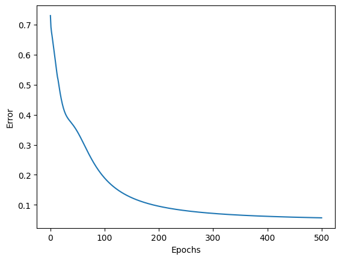
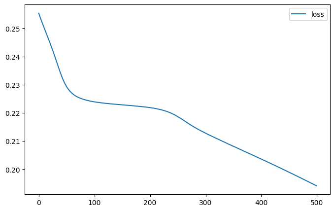
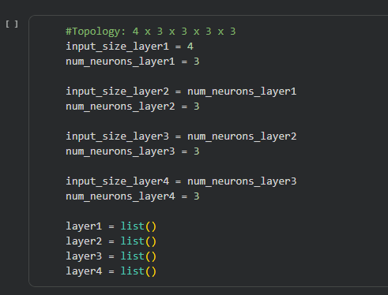
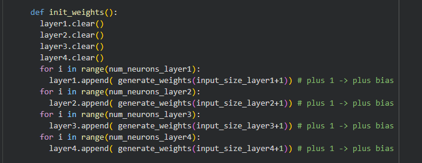
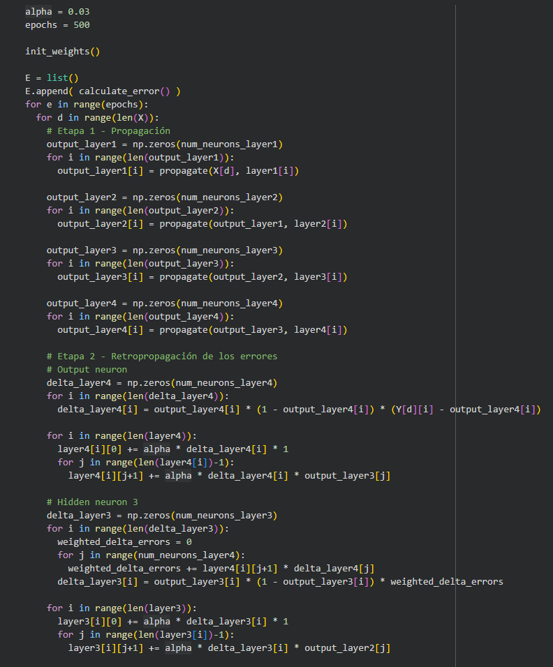
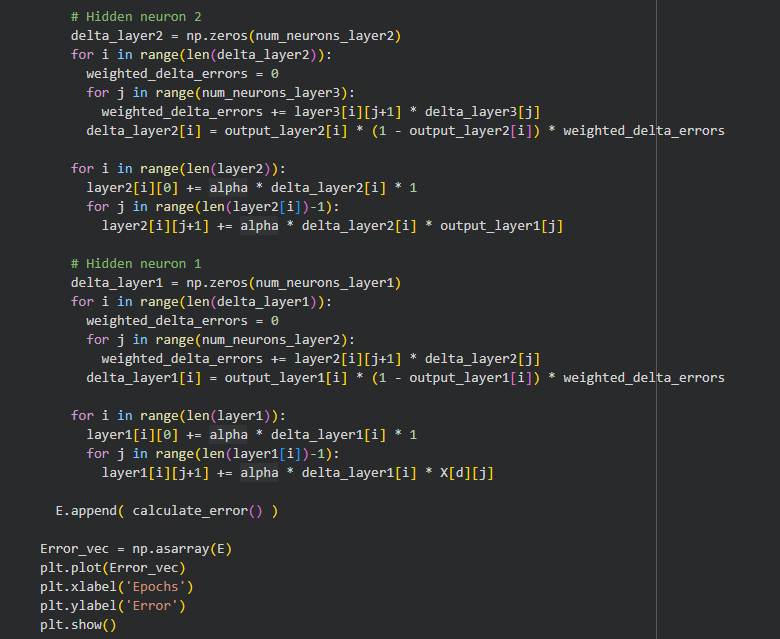
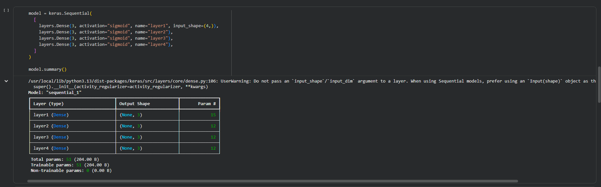
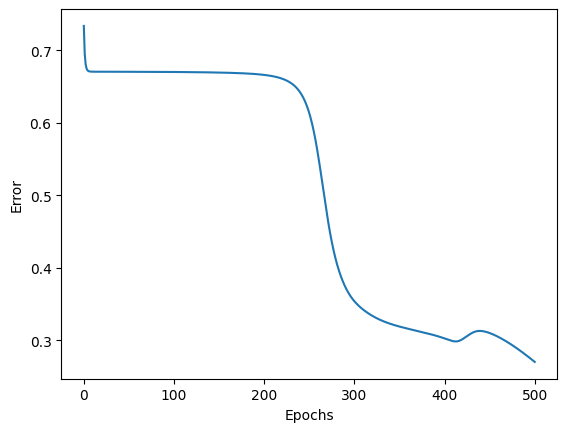
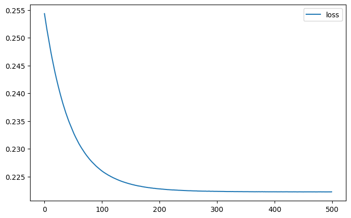

## Criterios de aceptación

Para el ejercicio se compararon 2 modelos de multilayer perceptron(MLP), una con una implementación manual mediante NumPy y otra con Keras, ambas empleando el dataset Iris de sklearn. Ambas redes cuentan con activación sigmoide, error MSE, SGD con ($\eta = 0.03$), 500 épocas y configuración de  $4 \times 3 \times 3$.

Si bien para ambos MLP los pesos iniciales son aleatorios, podemos notar como durante el avance de las épocas y la actualización de los pesos estos van reduciendo el error de manera que se acercan a un valor de $0.1$. También es notorio que debido a dicha aleatorización las curvas son diferentes ya que el de NumPy inicia con un margen de error muy alto de más de $0.7$ lo que hace que su descenso durante las primeras 100 épocas sea pronunciada para luego seguir reduciendo de una manera más gradual y estable. Por otro lado, el modelo Keras inicia con un margen de error pequeño de $0.255$, también presenta una caída rápida durante las primeras épocas, seguida de un periodo de relativa estabilidad entre las épocas 50 y 200, para luego volver a disminuir de forma constante hasta el final del entrenamiento.

| NumPy | Keras |
|---|---|
|  |  |

Seguido de este experimento se procedió a modificar la estructura de ambos MLP unicamente agregando 2 nuevas capas ocultas con 3 neuronas cada una, terminando con una topografía de $4 \times 3 \times 3 \times 3 \times 3$. Esto requirió modificar el código para ajustarlo a esa configuración.

| NumPy | Keras |
|---|---|
|    |  |

El resultado en termino del error para ambos modelos bajo la nueva configuración fue peor con respecto a la original, esto se debe a que el aumento de capas en una red sigmoide con MSE no siempre hace que aprenda mejor ya que puede hacer que los gradientes se vuelvan muy pequeños, dificultando que las primeras capas aprendan, además se puede presentar una saturación de la función sigmoide, cuya derivada tiene un valor máximo de tan solo $0.25$. Por la regla de la cadena, al propagar el error hacia atrás (backpropagation) a través de múltiples capas, estas fracciones menores a uno se multiplican consecutivamente, lo que provoca que el gradiente decaiga de forma exponencial hacia cero.

| | NumPy | Keras |
|---|---|---|
| Original |  |  |
| Profunda |  |  |
