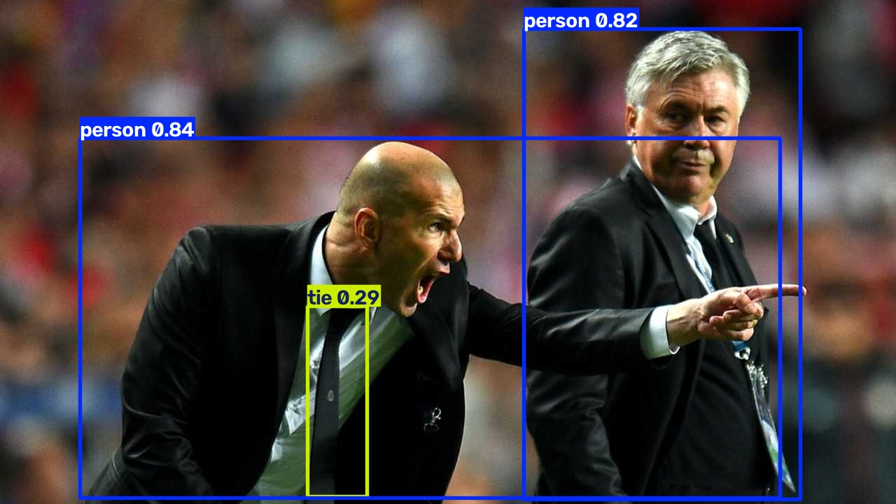
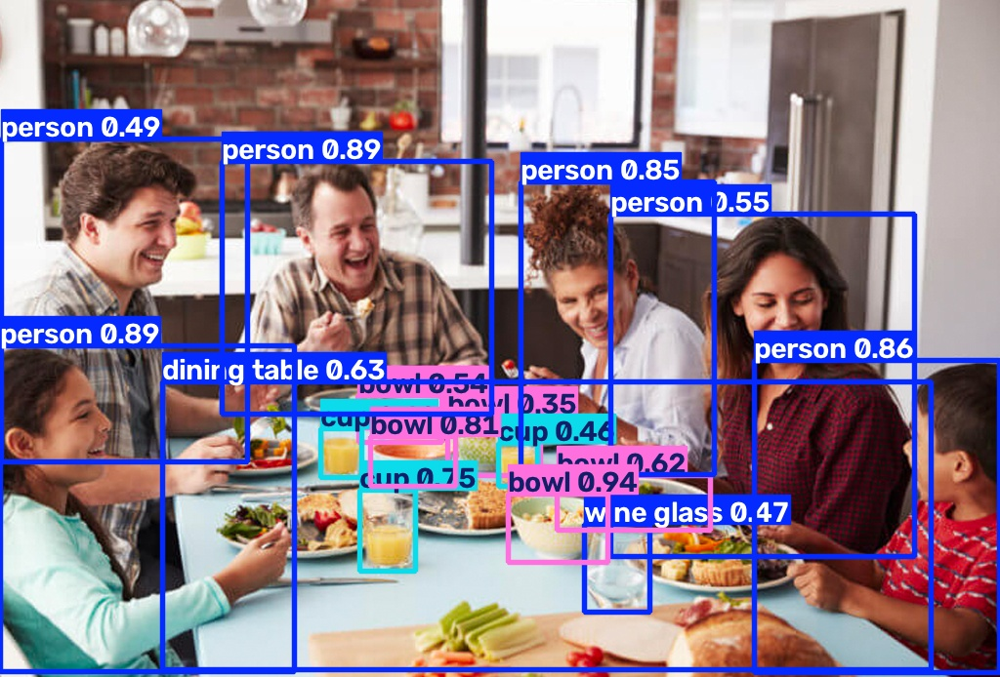
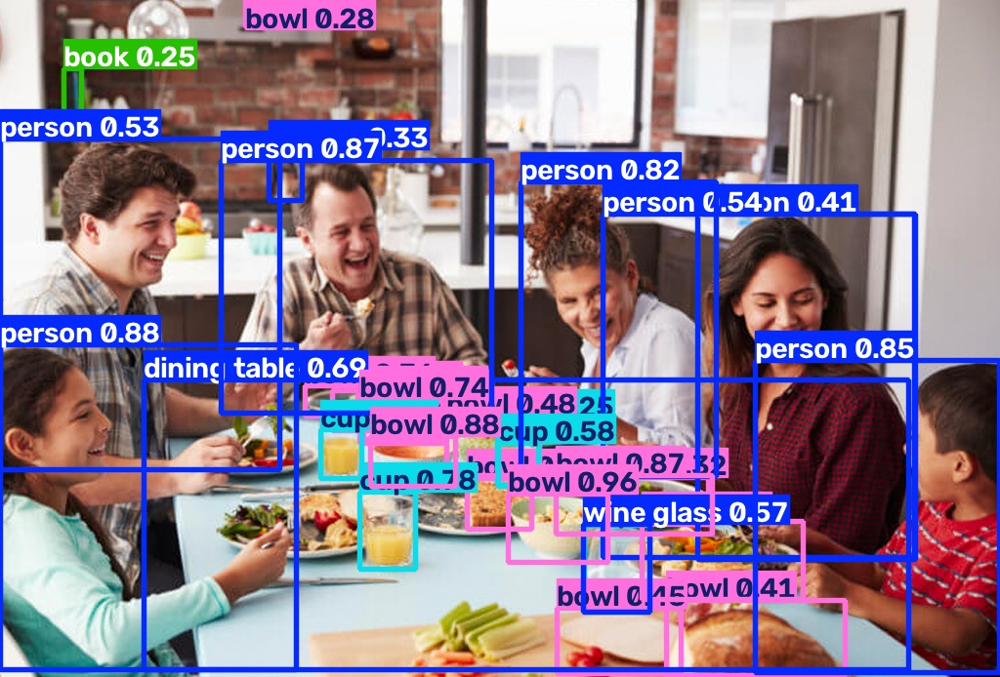
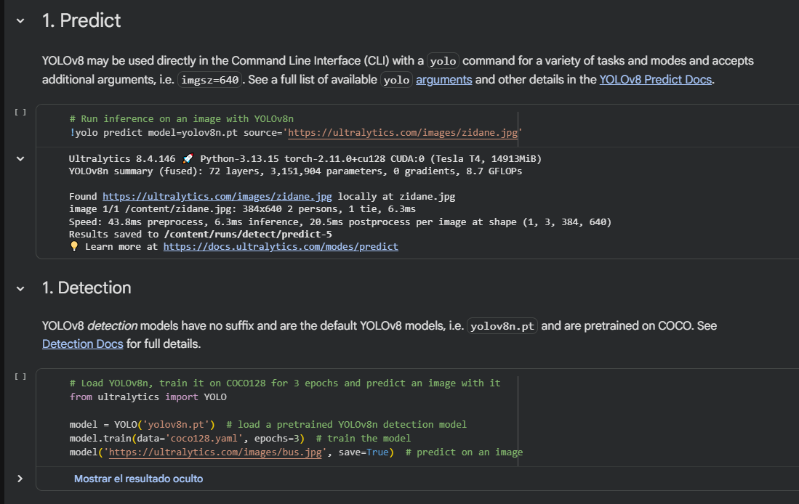
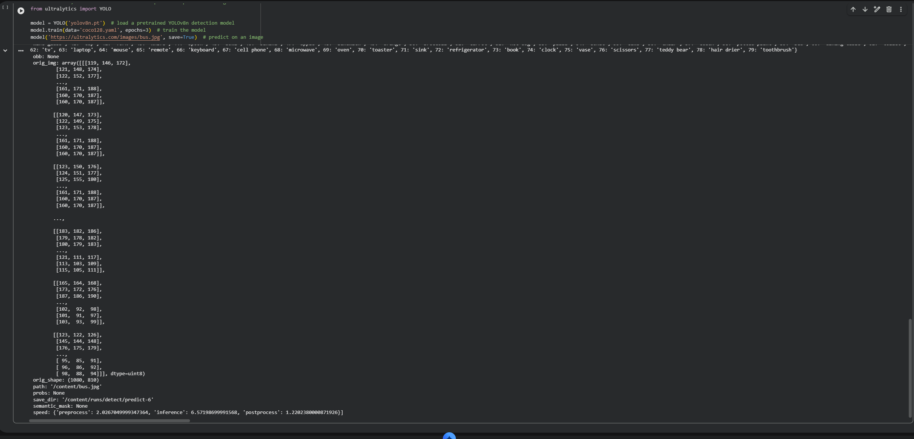
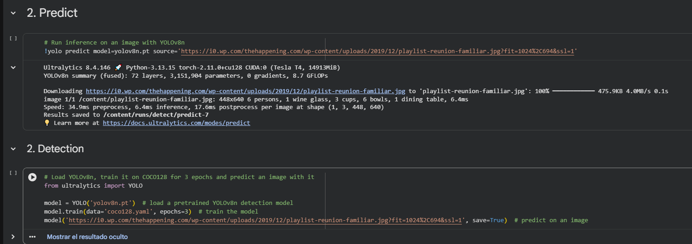
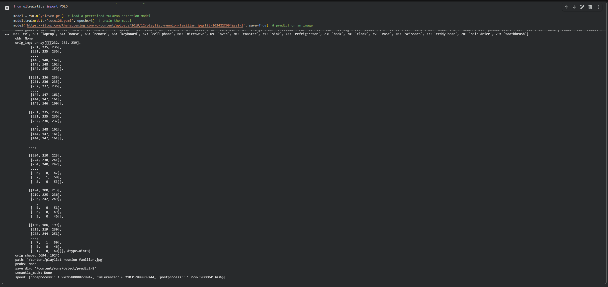

# Ejercicio 1 — Cambiar la imagen de predicción en YOLO

Para el ejercicio se evaluaron diferentes imágenes utilizando el modelo YOLOv8n, aplicando tanto la interfaz de línea de comandos (CLI) como un script en Python para un modelo entrenado con COCO128 con 3 épocas.

Para el caso de de imagen de Zidane, podemos encontrar unicamente 2 clases las cuáles son "person" y "tie". Para el caso de la imagen del autobus, se detectaron un total de 3: "person", "bus" y "stop sign". Para ambas imágenes podemos notar que el umbral de confianza para las clases detectadas es en su mayoría es alto.

| Zidane | Autobus |
|---|---|
|  |  |

Por ultimo, en la imagen propia podemos ver una pequeña variación en las clases entre el modelo por CLI y el entrenado ya que ambos detectaron las clases "person", "bowl", "dinning table", "cup y "wine glass" pero el modelo entrenado añadió  la clase "book". 

| CLI | Entrenada |
|---|---|
|  |  |

Asimismo, se nota que el modelo entrenado generó una mayor cantidad de objetos identificados; sin embargo, prácticamente todos corresponden a errores de etiquetado, ya que están clasificados incorrectamente como "bowl". Otra particularidad de este modelo es que no logró identificar el refrigerador del fondo, el cual podría considerarse un objeto de uso común. Esto último puede deberse a varios factores:

- Es posible que no forme parte de las clases del conjunto COCO.

- La resolución y el enfoque de la imagen difuminan el fondo, dado que el objetivo principal era la reunión familiar y no los elementos de la cocina.

- El objeto se encuentra parcialmente oculto detrás de una persona, lo que dificulta su reconocimiento.|

## Evidencias de ejecución

### Imágenes por defecto

### Imagen personalizada

